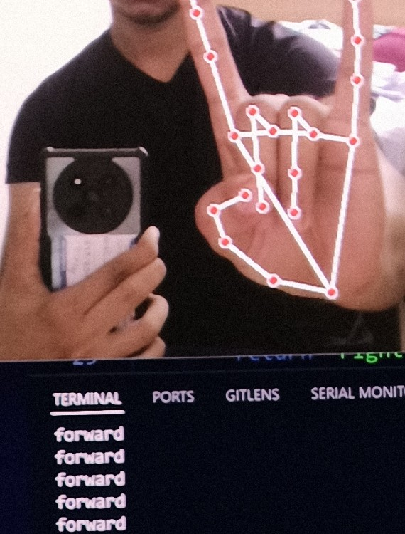
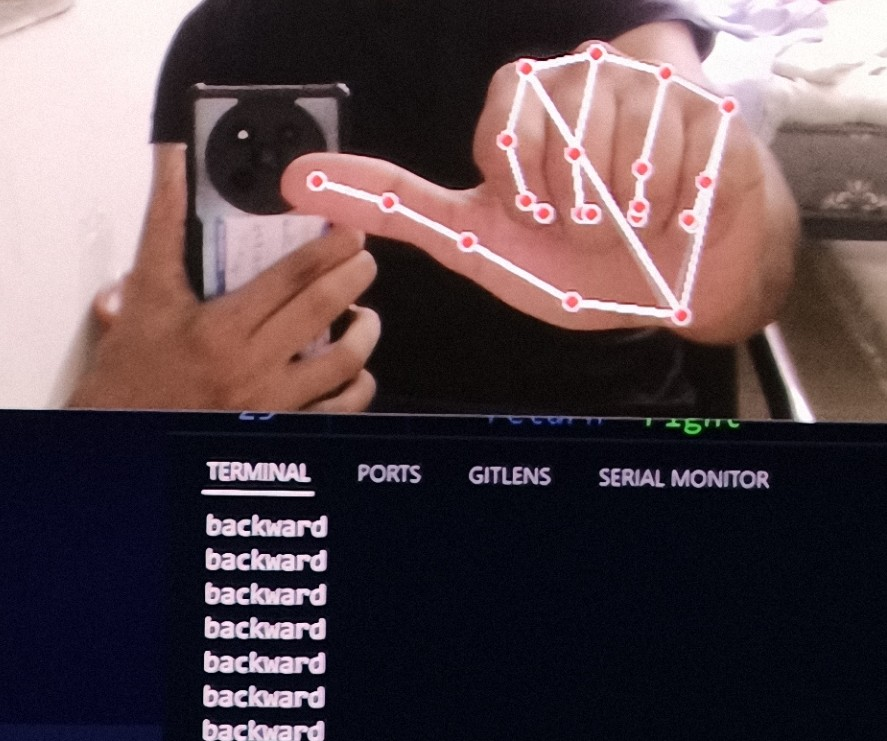
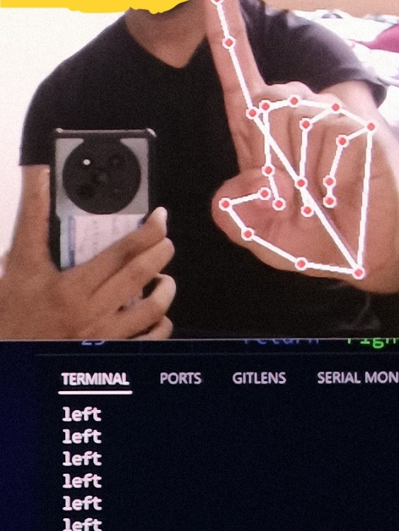
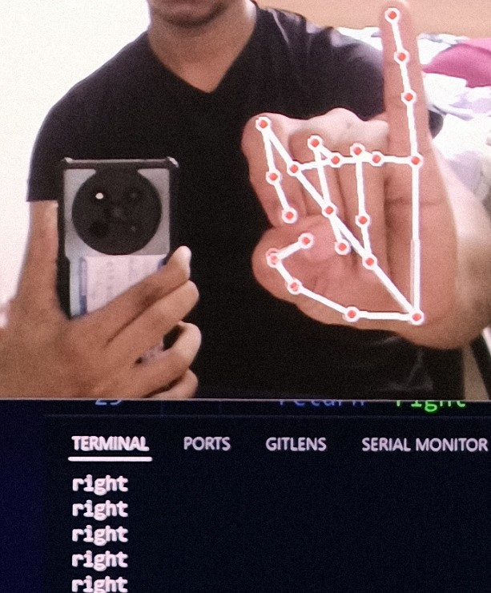
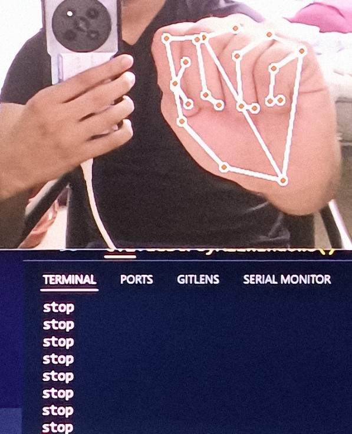

# Hand Gesture Controlled Car

## Introduction
- Forward:- 
- Backward:- 
- Left:- 
- Right:- 
- Stop:- 

## Components Used
- Laptop for running the code in its camera
- ESP32 connected to laptop vio USB for transmitting the data to the car
- ESP8266 connected to the car for receiving the data and controlling the car using L298N motor driver

## Dependencies

- Arduino Libraries
  - `ESP8266WiFi.h`
  - `espnow.h`
  - `Wifi.h`

- `pip install opencv-python MEDIApipe pyserial`

## How to run the code
- Run `Mac8266.ino` on the ESP8266 - press reset button on the ESP8266 to get the MAC address on the serial monitor.
- Run the `esp8266_receiver_code.ino` on the ESP8266 (cuation: change GPIO pins according to your connections in the code)
- Run the `esp32_sender_code.ino` on the ESP32(cuation: Use right COM port in the code and MAC address of the ESP8266)
- Run the `cv_sender_serial.py` on the laptop (cuation: change the COM port in the code according to the ESP32 connection)

## Working
- 